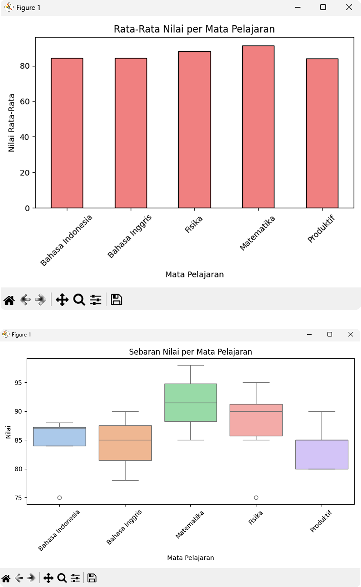

# 📊 Proyek Analisis dan Visualisasi Data Nilai Siswa

## 🌟 Ringkasan Proyek
Proyek ini bertujuan untuk menganalisis dan memvisualisasikan data nilai siswa menggunakan Python. Pustaka yang digunakan meliputi Pandas untuk pengolahan data, serta Matplotlib dan Seaborn untuk visualisasi. Hasil analisis memberikan gambaran performa akademik siswa di berbagai mata pelajaran

## 📈 Hasil Analisis Data (Insights)

- Mata Pelajaran dengan Rata-rata Tertinggi
- Matematika memiliki rata-rata nilai tertinggi → mayoritas siswa menunjukkan pemahaman yang baik.
- Mata Pelajaran dengan Nilai Terendah
- Bahasa Inggris memiliki nilai minimum terendah → beberapa siswa mungkin butuh dukungan tambahan.
- Peran Visualisasi
- Grafik batang dan boxplot membantu memahami perbandingan dan sebaran nilai secara cepat dan intuitif.

---

## 💡 Refleksi Pembelajaran

- Hal Baru yang Dipelajari
- Menggunakan Python untuk membaca dan memproses data (CSV).
- Menghitung statistik dasar: mean, median, min, max.
- Membuat visualisasi yang menyampaikan cerita dari data.
- Tantangan dalam Visualisasi
- Menyesuaikan ukuran font, rotasi label, dan skema warna agar grafik tetap jelas dan menarik.
- Peran AI
- AI sangat membantu dalam menjelaskan konsep, memperbaiki kode, dan mempercepat interpretasi hasil.

---

## 🛠️ Alat dan Pustaka yang Digunakan
- Bahasa: Python
- Pustaka:
- pandas → manipulasi data
- matplotlib → visualisasi dasar
- seaborn → visualisasi statistik

---

### Grafik Rata-Rata Nilai per Mata Pelajaran dan Boxplot Sebaran Nilai per Mata Pelajaran

 
